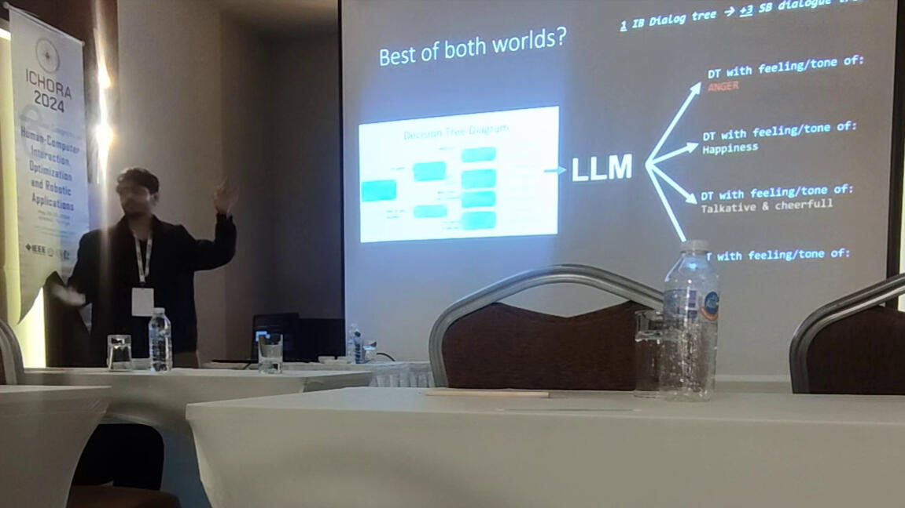
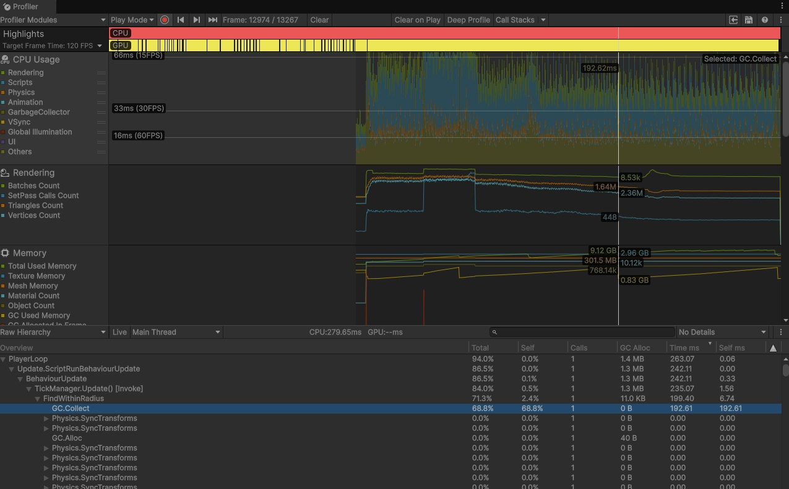
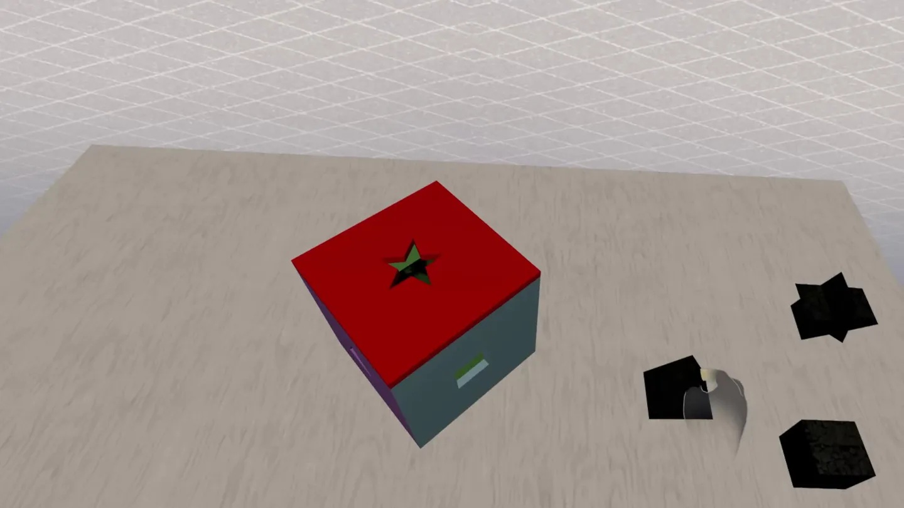

<header class="hero-portfolio">
  

    <nav class="site-nav sticky-header">
      <a class="site-title-link" href="#">Mahdi Jahangiri</a>
      

        <a class="site-nav-item" href="#projects">Projects</a>
        <a class="site-nav-item" href="#about">About</a>
        <a class="site-nav-item" href="#contact">Contact</a>
      

    </nav>

    
Games Programmer & AI Engineer

    <h1>Mohammed Mahdi Jahangiri</h1>
    <h2>Gameplay · AI · Real-Time Systems</h2>
    
I build gameplay systems, AI-driven NPC interaction, and VR experiences with Unity, Unreal Engine, C#, C++, and Python. My portfolio highlights shipped titles, research-led AI prototypes, and production tooling for game teams.

    

      <a class="primary" href="#contact">Contact</a>
      <a class="secondary" href="#projects">Projects</a>
      <a class="secondary" href="mailto:mapjiv@live.com">Email</a>
      <a class="secondary" href="assets/Mahdi_Jahangiri_CV_Games.pdf" download>Download CV</a>
    

  

</header>

<main class="main-inner">
  <section id="projects" class="section-portfolio">
    <h2>Featured work</h2>
    
Projects that demonstrate gameplay engineering, AI systems, VR publishing, and academic research.

    

      <h3>360° Dome Projection UI Warping — Awkward Studios / Media Cymru</h3>
      
Unity, C#, TextMesh Pro, URP, GitHub PR workflow

      

        
      

      

        
<strong>What:</strong> Fixed severe text distortion on a 360° dome-projection game-show installation for CULTVR Lab.

        <ul>
          <li>Developed an editor-safe <strong>Unity C#</strong> component that directly manipulated <strong>TextMesh Pro</strong> vertex buffers using trigonometry and <strong>Quaternion</strong> rotations to warp text around a virtual cylinder.</li>
          <li>Engineered a projection-boundary clipping system using <strong>InverseLerp</strong> and <strong>SmoothStep</strong> to eliminate text artifacting at half-sphere dome limits.</li>
          <li>Authored <strong>URP shaders</strong>, material setups and particle effects for large-scale immersive projection.</li>
          <li>Programmed modular mini-game state transitions using <strong>C# delegates</strong> and <strong>coroutines</strong>, decoupling sequence logic from UI flow.</li>
        </ul>
        
Result: Legible text at extreme projection angles across a half-sphere dome, shipped for a live installation.

        
        

          
Vertex Warping — C#


// Maps flat TextMesh Pro vertices onto a virtual cylinder
// preserving text legibility at extreme projection angles
for (int i = 0; i < vertices.Length; i++)
{
    Vector3 localPos = transform.InverseTransformPoint(vertices[i].position);
    float angle = Mathf.Atan2(localPos.z, localPos.x);
    float radius = domeRadius + localPos.y * heightScale;
    
    vertices[i].position = new Vector3(
        radius * Mathf.Cos(angle),
        localPos.y,
        radius * Mathf.Sin(angle)
    );
}

        

      

    

    

      <h3>AI-Driven NPC Interaction Prototype</h3>
      
Unreal Engine 5, C++, Python, FastAPI, Whisper, Wit.ai, Hugging Face

      

        
      

      

        
<strong>What:</strong> A real-time, voice-driven NPC interaction system in Unreal Engine 5.

        <ul>
          <li>Built a local <strong>Python FastAPI</strong> server bridging real-time microphone input to a <strong>C++</strong> application via a custom REST API.</li>
          <li>Integrated <strong>Whisper</strong> (speech-to-text), <strong>Wit.ai</strong> (intent classification) and local <strong>Hugging Face</strong> models for real-time text and voice emotion detection.</li>
          <li>Trained the voice-emotion model and configured <strong>Wit.ai</strong> intents using custom voice recordings.</li>
          <li>Wired microphone capture in <strong>C++</strong>, returning predicted intent/emotion signals to drive real-time <strong>behaviour-tree</strong> decision logic.</li>
        </ul>
        
Result: A working end-to-end pipeline from player voice input to NPC-relevant intent and emotion signals.

        
        

          
FastAPI Endpoint — Python


@app.post("/predict")
async def predict(audio: UploadFile):
    # Speech-to-text via Whisper
    text = whisper_model.transcribe(audio.file)
    
    # Intent classification via Wit.ai
    intent = wit_client.message(text)
    
    # Emotion detection via local Hugging Face
    emotion = emotion_pipeline(text)
    
    return {
        "text": text,
        "intent": intent,
        "emotion": emotion
    }

        

        

          
System Architecture

          <pre class="diagram">
[Player Microphone]
        ↓
[Unreal C++ Mic Capture]
        ↓ (HTTP POST)
[Python FastAPI Server]
    ├── [Whisper] → Speech-to-Text
    ├── [Wit.ai] → Intent Classification
    └── [Hugging Face] → Emotion Detection
        ↓ (JSON Response)
[Unreal Behaviour Tree] → NPC Action
          </pre>
        

      

    

    

      <h3>Apoceus: Winter Wars — Landell Games</h3>
      
Unity, C#, Unity DevOps, Plastic SCM, Steam

      

        
      

      

        
<strong>What:</strong> A 3–6 person Unity team project, shipped weekly to a private Steam branch.

        <ul>
          <li>Coordinated a <strong>3–6 person programming team</strong>, translating production priorities into sprint tasks and raising sprint success from <strong>40% to 90%</strong>.</li>
          <li>Profiled and optimised rendering bottlenecks with the <strong>Unity Profiler</strong>, improving frame time by <strong>10–30 FPS</strong> on target hardware.</li>
          <li>Owned weekly <strong>Unity DevOps</strong> branch merges and uploaded builds to a private <strong>Steam</strong> branch.</li>
          <li>Implemented <strong>ScriptableObject</strong>-based unit/data configuration, Unity asset/<strong>LOD</strong> setup and gameplay <strong>state-machine</strong> logic, supporting designer-led balance tweaks.</li>
        </ul>
        
Result: Consistent weekly playable builds across the team's Steam branch.

      

    

    

      <h3>VR Playground — Meta Quest Store</h3>
      
Unity, C#, Meta Quest SDK

      

        
      

      

        
<strong>What:</strong> A standalone VR game, shipped to the Meta Quest Store.

        <ul>
          <li>Built and tuned the <strong>core gameplay loop</strong> with physics-based standalone headset-only interaction.</li>
          <li>Handled the full <strong>Meta Quest Store</strong> submission, compliance and publishing pipeline.</li>
          <li>Optimised draw calls and texture memory for mobile VR constraints, maintaining stable frame rates on Quest 2 hardware.</li>
          <li>Iterated post-launch on player feedback, tuning interaction and performance.</li>
        </ul>
        
Result: Live, published title on the Meta Quest Store.

      

    

    

      <h3>Hand-Tracked VR Interaction Prototype</h3>
      
Unity, hand-tracking SDKs, mobile VR

      

        
      

      

        
<strong>What:</strong> A hand-tracked VR interaction prototype, built after evaluating Unreal's mobile VR pipeline against Unity.

        <ul>
          <li>Compared Unreal and Unity for mobile VR and hand-tracking support, choosing Unity based on API and documentation maturity.</li>
          <li>Integrated third-party hand-tracking APIs with limited documentation.</li>
          <li>Delivered a working prototype under real technical uncertainty, planning sprints around unknown variables.</li>
        </ul>
        
Result: A working hand-tracked prototype, and a clear technical comparison that shaped the engine choice for the project.

      

    

    

      <h3>Publication — ICHORA 2024</h3>
      
Research, LLMs, pursuit learning automata, NLP, local AI systems

      

        
      

      

        
<strong>What:</strong> Published and presented a conference paper on resource-efficient NPC dialogue using local LLMs.

        
<em>Balancing Game Satisfaction and Resource Efficiency: LLM and Pursuit Learning Automata for NPC Dialogues</em>

        <ul>
          <li>Proposed a resource-efficient local LLM pipeline for dynamic NPC dialogue, applying <strong>pursuit learning automata</strong> to balance player satisfaction against computational cost.</li>
          <li>Explored local AI methods that reduce reliance on cloud APIs for real-time applications.</li>
          <li>Presented research findings at ICHORA 2024.</li>
        </ul>
        
Result: A published paper linking academic research to game AI engineering. This research underpins my current MSc dissertation on safe, efficient AI companions.

        

          <a href="https://scholar.google.com/scholar?q=Balancing+Game+Satisfaction+and+Resource+Efficiency+LLM+Pursuit+Learning+Automata+NPC+Dialogues" target="_blank" rel="noopener">View on Google Scholar →</a>
        

      

    

  </section>

  <section id="about" class="section-portfolio">
    <h2>About</h2>
    
Professional experience focused on games programming, AI systems, and production-ready tooling.

    
MSc Artificial Intelligence candidate at <strong>Cardiff University</strong>. Published research on LLM-driven NPC dialogue (<strong>ICHORA 2024</strong>). Shipped a VR title to the <strong>Meta Quest Store</strong>. Led a programming team on a Steam-bound Unity project. I work at the intersection of gameplay, AI, and real-time systems — delivering playable game features, AI prototypes, and production pipelines for small teams and immersive titles.

  </section>

  <section id="contact" class="section-portfolio section-contact">
    <h2>Contact</h2>
    
Get in touch for gameplay engineering, AI systems, or portfolio reviews.

    

      

        <h3>Email</h3>
        
<a href="mailto:mapjiv@live.com">mapjiv@live.com</a>

      

      

        <h3>Links</h3>
        
<a href="https://github.com/devPirate01" target="_blank" rel="noopener">GitHub</a>

        
<a href="https://linkedin.com/in/m-jahangiri" target="_blank" rel="noopener">LinkedIn</a>

      

    

  </section>
</main>